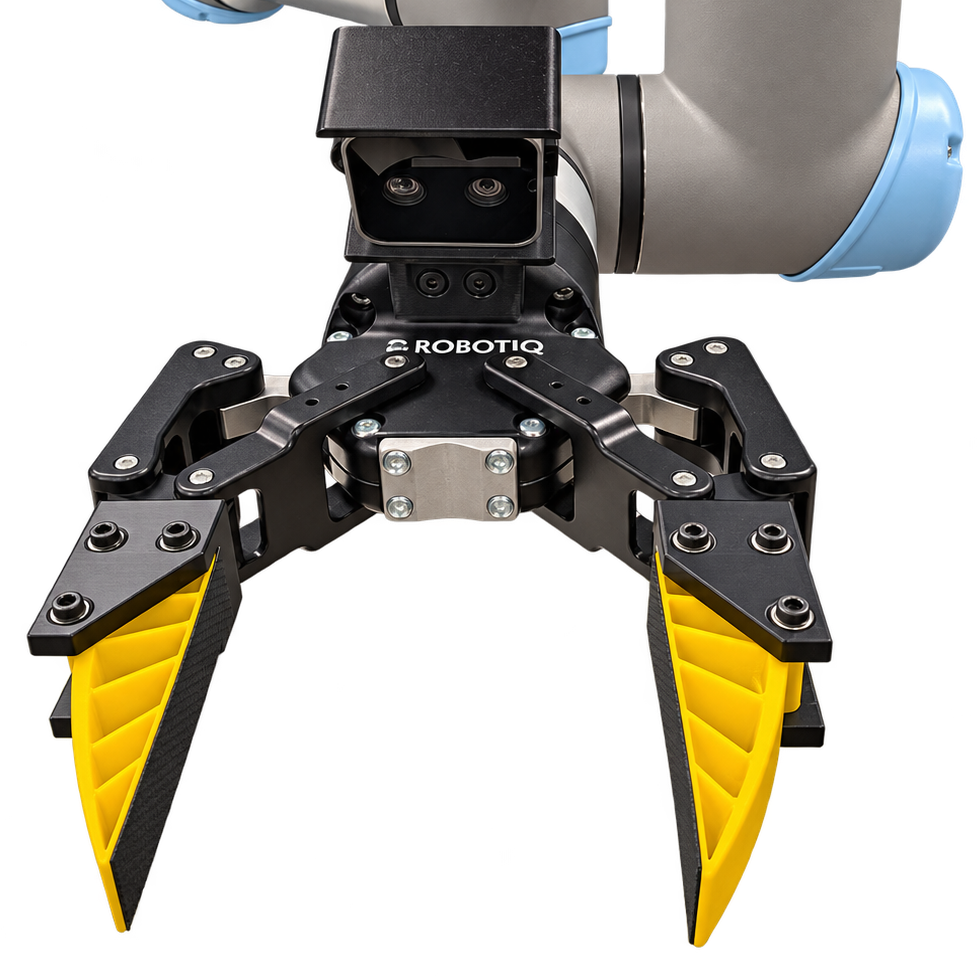
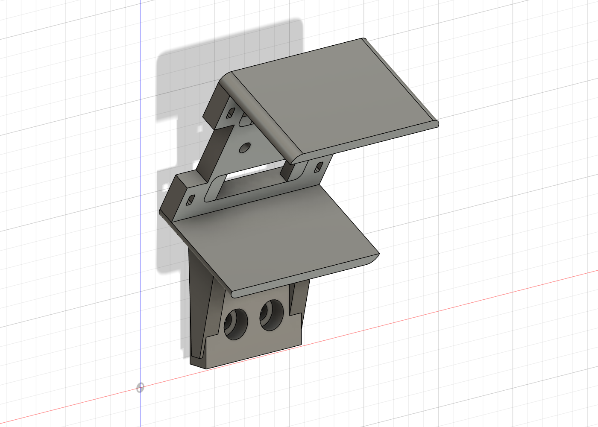
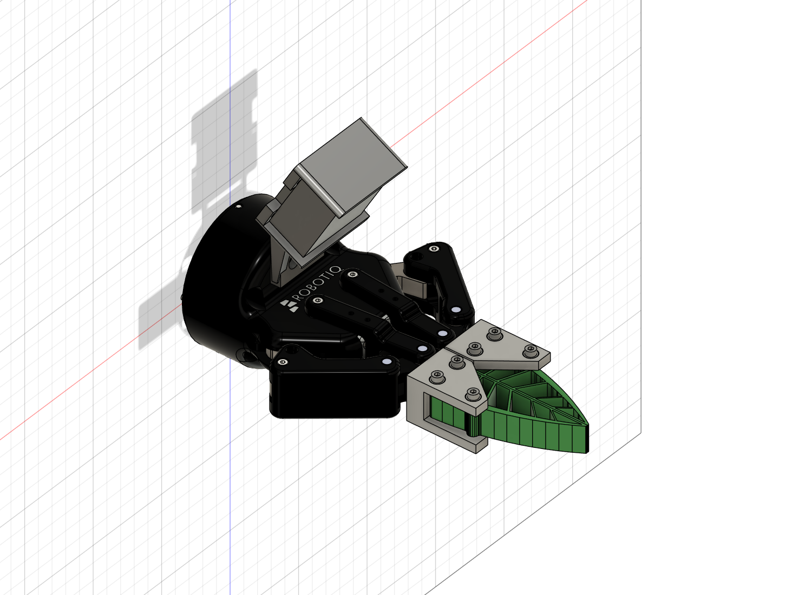

# Robotiq 2F-85 D405 mount

One-piece PETG wrist camera mount for the RealSense D405 on the Robotiq 2F-85. The R2 design preserves the existing two-screw gripper seat and adds a fixed camera plate, two support ribs, protective rails, and cable-tie slots. It aims the camera toward the TPU fingers for contact views.

<p align="center">
  
</p>

Installed prototype with the D405 above the TPU fingers.

## Print and assemble

Download the **[R2 print package](D405_wrist_mount_R2_print_package.zip)** or the **[print-ready STL](D405_wrist_mount_R2_PRINT.stl)**. Print one copy in PETG, in millimeters at 100% scale, using the supplied orientation.

Read the **[print and assembly guide](PRINT_AND_ASSEMBLY.md)** for print settings, support placement, screw lengths, cable routing, camera framing, and verification limits. The guide is also included in the print package.

## CAD and source



| File | Purpose |
| --- | --- |
| [STEP model](D405_wrist_mount_R2.step) | Editable mount in the gripper assembly frame |
| [Fusion archive](D405_R2_mount.f3d) | Editable Fusion CAD |
| [Build script](build_mount.py) | CadQuery generator and mechanical checks |
| [Preserved mounting seat](reference/preserved_two_screw_seat.step) | Included source geometry for the two-screw interface |
| [Requirements](requirements.txt) | Python dependency versions used for this release |
| [SHA-256 manifest](SHA256.json) | Checksums of the supplied R2 release files |

The mount source and its required mounting-seat geometry are included here. To rebuild, use Python 3.10 in a copy of this directory:

```sh
python -m pip install -r requirements.txt
python build_mount.py
```

The generator overwrites the mount STEP, print STL, and mechanical check results, and produces a camera envelope and preview mesh. Rebuild a copy to preserve the supplied release files and checksums. It does not regenerate the Fusion archive, rendered images, or optical and Fusion check results; see the [rebuild notes](PRINT_AND_ASSEMBLY.md#rebuilding-the-mount).

## Assembly and verification



The camera is shown as a dimensioned envelope. The recorded [mechanical checks](mechanical_checks.json) and [closed-assembly Fusion check](fusion_closed_check.json) pass for the nominal geometry. The [optical checks](optical_checks.json) and [synthetic lens views](D405_R2_optical_views.png) document the camera framing assumptions.

This is a printable prototype. Physical fit, full gripper motion, camera depth quality, cable behavior, mount stiffness, and impact resistance still need verification. The opening envelope is a geometric check, not solved gripper kinematics or simulated TPU deformation. Follow the assembly guide and perform a slow, unloaded opening/closing check before use.

## Companion gripper

The PETG finger adapters, TPU fingers, print packs, and gripper build scripts are maintained in [robotiq-2f85-umi-gripper](https://github.com/sri299792458/robotiq-2f85-umi-gripper). This mount's recorded closed-assembly check used the V2.2 adapters and TPU finger reference from that project.
